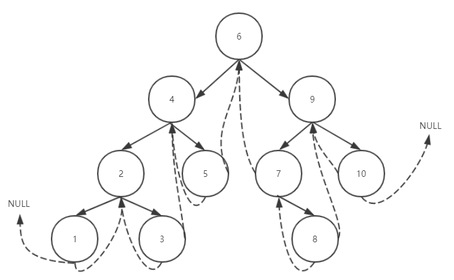

## 学习笔记

#### 基本介绍

hashMap本质上是一个散列表，为了解决hash冲突的问题，它使用的是链表法：出现散列冲突时，相同槽位的数据，放到一个链表里。

**初始的table长度：16**

```
/** * The default initial capacity - MUST be a power of two. */ 
static final int DEFAULT_INITIAL_CAPACITY = 1 << 4; // aka 16
```

为什么要是2的倍数呢，下面分析。

**初始的加载因子：0.75**

```
/**
 * The load factor used when none specified in constructor.
 */
static final float DEFAULT_LOAD_FACTOR = 0.75f;
```

也就是超过3/4的容量被使用后，会触发Map对table扩容。扩容的大小为原来的两倍。

```
(newCap = oldCap << 1)
```

**链表转红黑树的长度阈值是8**

```
static final int TREEIFY_THRESHOLD = 8;
```

**hashmap是根据key的hashcode值来计算槽位的**

```
static final int hash(Object key) {
    int h;
    return (key == null) ? 0 : (h = key.hashCode()) ^ (h >>> 16);
}
```

问题来了，hashCode函数返回的是个int类型的数值，每个对象不一样，数据有非常多。但是table的初始大小只有16，怎么样映射到16个槽位上呢？

```
tab[i = (n - 1) & hash] 
```

就是和table的长度按位与运算一下，把长度当成掩码使用。这也说明了为什么长度要是2的倍数，因为减一后刚好是个低位掩码

比如说，如果长度是16，减一 = 15 = 0000 0000 0000 0000 0000 0000 0000 1111，刚好是一个低四位的掩码。

不管hash后的值是多少，按位与之后最后保存了后四位作为table的下标，0-15。

之所以还要一个hash函数，是因为需要对key的hashcode做一下扰动，避免key很规律的出现后4位都是同一个的情况。

**链表使用的是单向的链表结构**

```
Node(int hash, K key, V value, Node<K,V> next) {
    this.hash = hash;
    this.key = key;
    this.value = value;
    this.next = next;
}
```

**HashMap的put方法**

```java
 /**
 * Implements Map.put and related methods
 *
 * @param hash hash for key
 * @param key the key
 * @param value the value to put
 * @param onlyIfAbsent if true, don't change existing value
 * @param evict if false, the table is in creation mode.
 * @return previous value, or null if none
 */
final V putVal(int hash, K key, V value, boolean onlyIfAbsent,
               boolean evict) {
    Node<K,V>[] tab; Node<K,V> p; int n, i;
    if ((tab = table) == null || (n = tab.length) == 0)
        //如果是初始化后第一次调用put，需要调用扩容方法初始化table数组
        n = (tab = resize()).length;
    if ((p = tab[i = (n - 1) & hash]) == null)
        //如果计算出来的table槽位上没有链表节点，创建一个节点，放到指定的槽位
        tab[i] = newNode(hash, key, value, null);
    else {
        Node<K,V> e; K k;
        if (p.hash == hash &&
            ((k = p.key) == key || (key != null && key.equals(k))))
            //如果key完全一致，表示是更新操作，替换节点
            e = p;
        else if (p instanceof TreeNode)
            //如果是树
            e = ((TreeNode<K,V>)p).putTreeVal(this, tab, hash, key, value);
        else {
            for (int binCount = 0; ; ++binCount) {
                if ((e = p.next) == null) {
                     //找到链表的尾部，插入新的节点
                    p.next = newNode(hash, key, value, null);
                    if (binCount >= TREEIFY_THRESHOLD - 1) // -1 for 1st
                        //遍历链表长度超过了8，传化为红黑树
                        treeifyBin(tab, hash);
                    break;
                }
                if (e.hash == hash &&
                    ((k = e.key) == key || (key != null && key.equals(k))))
                    break;
                p = e;//遍历链表
            }
        }
        if (e != null) { // existing mapping for key
            V oldValue = e.value;
            if (!onlyIfAbsent || oldValue == null)
                e.value = value;
            afterNodeAccess(e);
            return oldValue;
        }
    }
    ++modCount;
    if (++size > threshold)//如果table的size比阈值，也就是16*0.75=12大，扩容
        resize();
    afterNodeInsertion(evict);
    return null;
}
```

#### 树



关于莫里斯遍历，一定要参考上图。

哪如何在遍历过程中避免去申请额外的空间呢？
我们知道对于一个拥有n个节点的二叉树，有2n个指针域，但是非空指针域有n-1个，空指针域有n+1个，这些空指针域能不能拿来用呢？
线索二叉树就是首先对一棵二叉树变成一棵线索二叉树，线索二叉树就是将左孩子空指针域指向其前驱节点，右孩子空指针域指向其后继节点，莫里斯算法就是基于线索二叉树来实现O(1)空间复杂度的遍历。

参考：https://yuuuuuy.top/2019/05/09/%E4%BA%8C%E5%8F%89%E6%A0%91%E9%81%8D%E5%8E%86-%E8%8E%AB%E9%87%8C%E6%96%AF%E7%AE%97%E6%B3%95/